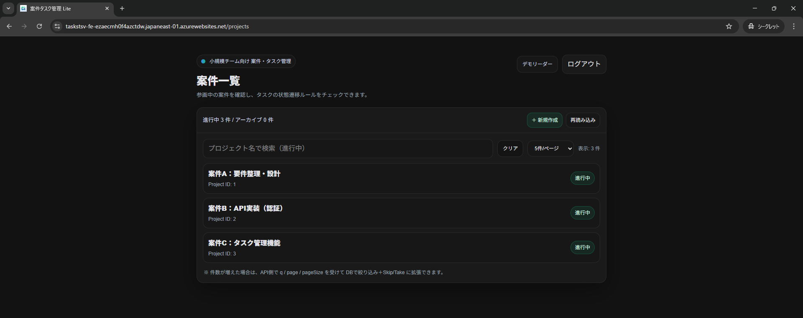
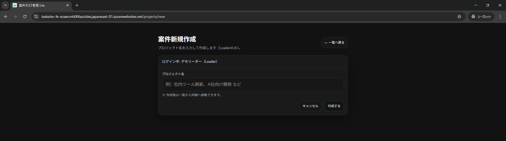
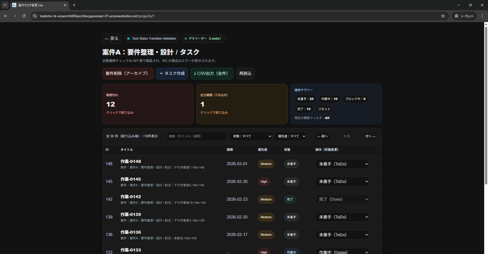
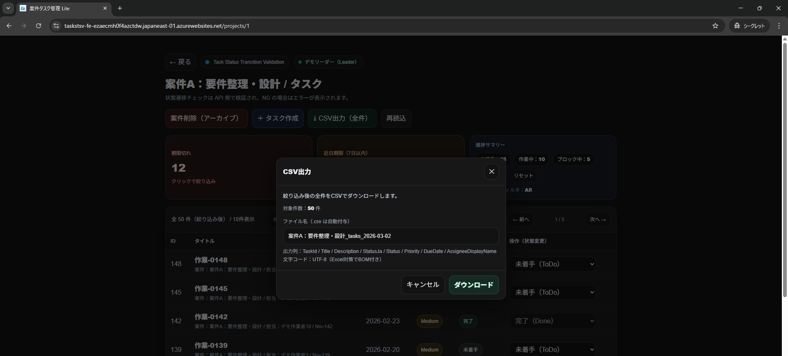
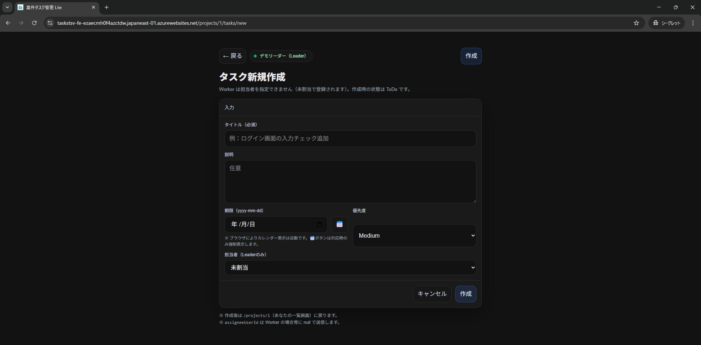
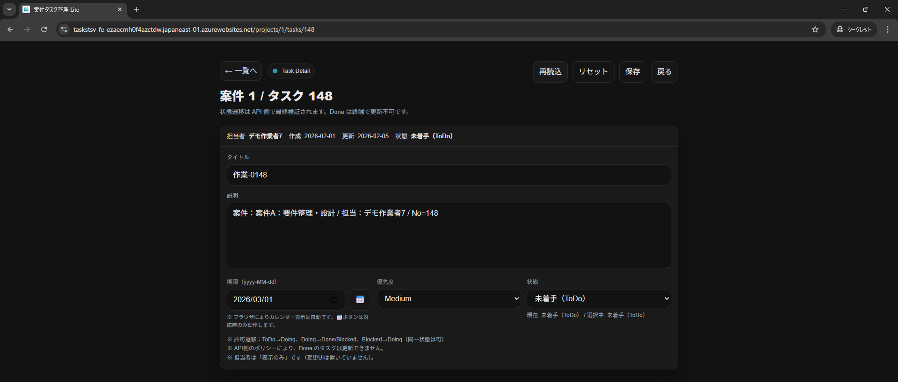
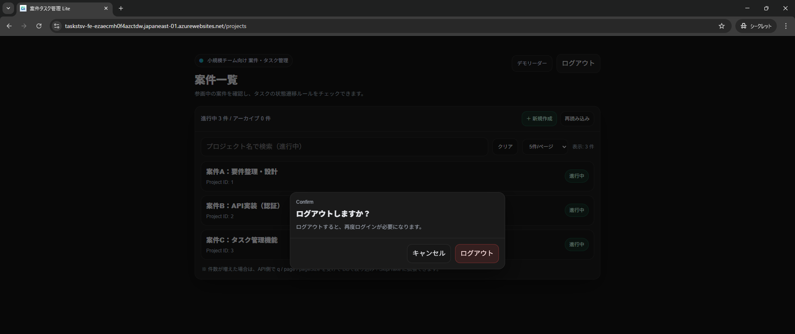

# 案件タスク管理 Lite（Frontend）

小規模チーム向けの **案件・タスク管理 Webアプリケーション** です。
案件単位でタスクを管理し、**状態遷移ルールをサーバー側で検証**することで、  
進捗状況をルールに沿って管理しやすいタスク管理を目的としています。

---

## 🔗 関連リポジトリ
- Backend / API（ASP.NET Core）: https://github.com/fewioaghwrao/TaskStatusTransitionValidation-API

---

## 🌐 デモ

**デモサイト**: https://yellow-tree-06abc4d00.4.azurestaticapps.net/login

以下のテストアカウントでお試しいただけます。

| 役割 | メールアドレス | パスワード |
|------|--------------|----------|
| Leader | demo1@example.com | Demo1234! |
| Member | demo2@example.com | Demo1234! |

> Leader / Member で操作できる機能が異なります。役割ごとの機能差は[こちら](#-役割ごとの機能差)をご参照ください。
> 本デモはコストを考慮し、Azure Static Web Apps 上で公開しています。 

---

## 📌 このアプリでできること

- 案件（プロジェクト）単位でのタスク管理
- タスク状態の厳密な遷移制御  
  （ToDo / Doing / Blocked / Done）
- 期限・優先度・担当者を考慮した一覧表示
- 状態別の進捗サマリー表示
- 絞り込み条件を反映した **CSV一括エクスポート**
- **役割（Leader / Member）による操作制限**

---

## 🖥️ 画面構成（主要）

### 案件一覧
案件の検索・ページング・新規作成が可能です（新規作成はLeaderのみ）。

---

### 案件新規作成（Leader）
案件名のみで即時作成できます。

---

### 案件詳細（タスク一覧）
タスクの進捗状況を一覧で確認できます。  
期限・状態別のサマリー表示にも対応しています。

---

### CSV出力
絞り込み後のタスクをCSV形式で一括ダウンロードできます。

**CSV出力仕様（概要）**  
UTF-8 / カンマ区切り  
出力列：案件名、タスク名、状態、優先度、期限、担当者、作成日時、更新日時

---

### タスク新規作成
タスクのタイトル・期限・優先度を指定して登録できます。

---

### タスク詳細・編集
タスク内容の編集および状態変更が可能です。  
状態遷移は API 側で検証され、不正な遷移はエラーとなります。

---

### ログアウト
ログアウト時は確認ダイアログを表示します。

---

## 👤 役割ごとの機能差

| 機能 | Leader | Member |
|---|---|---|
| 案件作成 | ○ | × |
| 案件アーカイブ | ○ | × |
| タスク作成 | ○ | ○ |
| 担当者指定 | ○ | × |
| 状態変更 | ○ | ○ |
| CSV出力 | ○ | ○ |

---

## 🔁 画面遷移（概要）

ログイン  
→ 案件一覧  
→ 案件詳細  
→ タスク詳細 / タスク作成  

※ Leader / Member により操作可能範囲が異なります。

---

## 🛠 技術スタック（フロントエンド）

- Next.js（App Router）
- TypeScript
- Tailwind CSS
- Fetch API
- Azure Static Web Apps（フロント公開）

---

## 🎯 想定利用シーン

- 小規模チームのタスク管理
- 業務要件整理・進捗管理
- 状態遷移ルールを重視する管理系業務

---

## 🚀 今後の拡張構想

- タスクコメント機能
- メンバー招待
- 操作ログ（監査）
- 状態遷移ルールのカスタマイズ